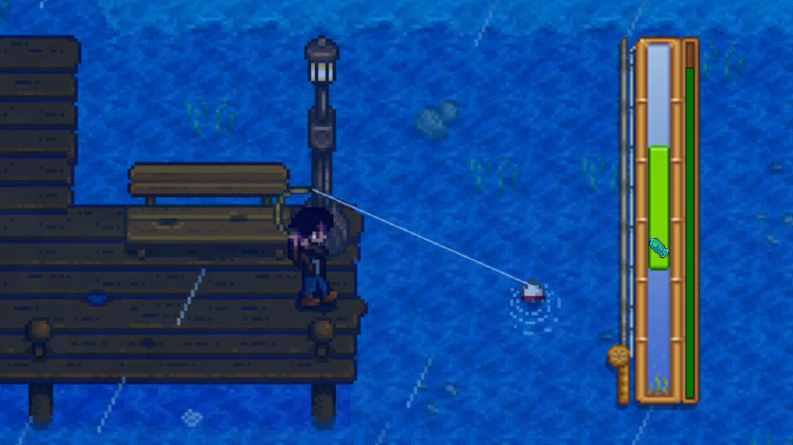

# Stardew Fishing



## Descrição do Jogo
Stardew Fishing é um jogo de pesca de _quick time event_ que utiliza da biblioteca [graphics](https://mcsp.wartburg.edu/zelle/python/graphics.py), onde o jogador deve capturar peixes em um ambiente inspirado no minigame de pesca de Stardew Valley, criado originalmente por Eric Barone (CorcernedApe). O objetivo principal é pescar peixes em uma barra com um cursor de pesca que se move de maneira fluida, atento à movimentação do peixe que acrescenta ao desafio.

<p align="center">
    
    
    
    
    
</p>

## Controles
### Captura do peixe
Enquanto o jogo está em execução, há uma chance aleatória de surgir um peixe. O jogador deve ser ágil para escutar o som de fisgada e voltar para o jogo em um tempo rápido o bastante para entrar no modo de captura. Para capturar um peixe, o jogador deve manter o cursor sobre o peixe na barra de pesca por um determinado tempo, controlando-o com a barra de espaço ou com a seta para cima.

### Cursor e gravidade
O cursor de pesca se comporta de forma fluida, movendo-se de acordo com a gravidade. A aceleração de queda faz com que o jogador precise ser ágil para controlar o cursor e garantir que ele esteja na posição certa para capturar o peixe.

### Barra de progresso
A barra de progresso é um indicador de quão próximo o jogador está de fisgar o peixe. Quanto mais tempo o cursor ficar em contato com o peixe, mais a barra vai se enchendo. Se o cursor perder o contato com o peixe, a barra de progresso começa a diminuir gradativamente. Se a barra chegar a zero, o peixe escapa e o jogador perde a captura.

## Dificuldade
### Raridade dos peixes
Os peixes possuem raridades aleatórias, que influenciam tanto sua velocidade de movimento quanto a intensidade da oscilação. Peixes mais raros se movem de maneira mais imprevisível e difícil de capturar, o que aumenta a dificuldade do jogo.

### Tamanho do cursor
O tamanho do cursor varia de acordo com a dificuldade do peixe. Quanto maior a dificuldade, menor será o cursor, o que exige precisão e timing para fisgar o peixe.

### Pontuação e progresso
O objetivo do jogo é capturar o maior número possível de peixes, que são convertidos em um valor determinado por sua raridade.

<p align="center">
    
    
    
    
    
</p>

## Dependências
```shell
python python-tk
```

## Como instalar
```shell
git clone https://github.com/juanmadeira/stardewfishing
cd stardewfishing
python stardewfishing.py
```